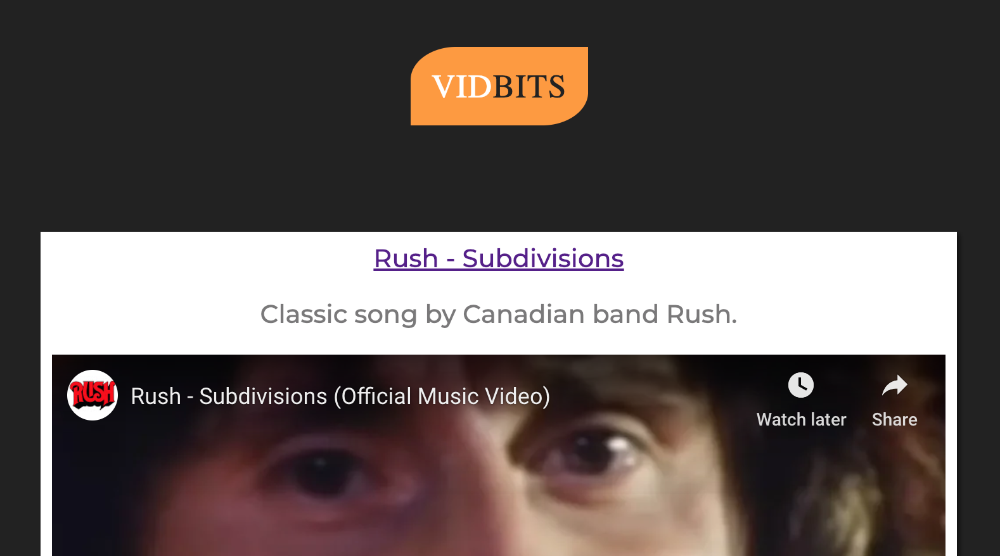
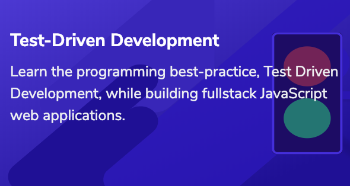
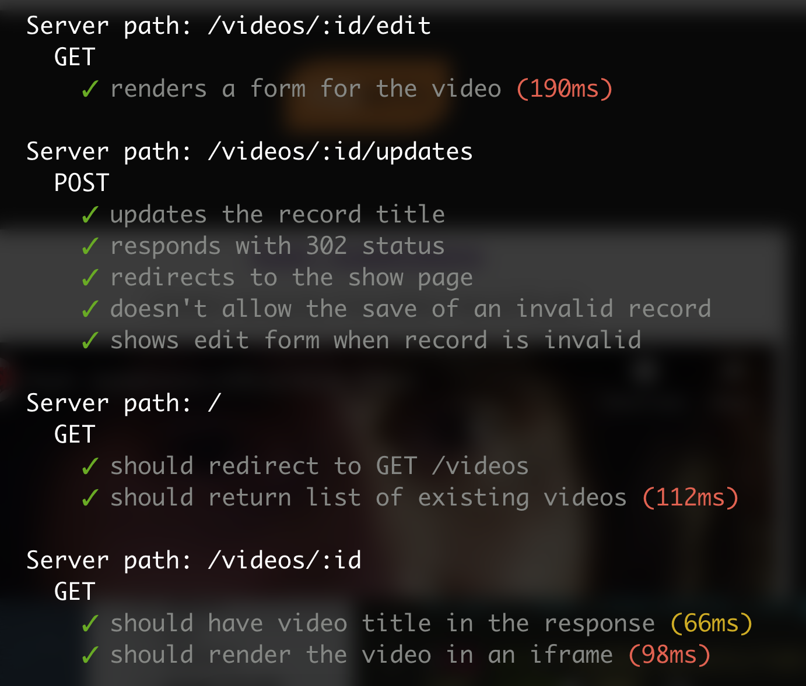

## vidbits-codecademy

#### Description
Simple web application which allows for the Creation, Reading, Updating, and Deletion of pages containing embedded iframes. Completed as a homework assignment for [Codecademy Test-Driven-Development (TDD) online course.](https://www.codecademy.com/pro/intensive/test-driven-development)

#### Technology

- Node.js (requires v8)
- Express
- Mocha & Chai
- WebDriverIO
- phantomJS
- SuperTest
- Mongoose & MongoDB

#### Setting Up

- requires Node.js and MongoDB to be installed

1. `git clone git@github.com:kevcom/vidbits-codecademy.git`
2. `cd vidbits-codecademy`
3. `mkdir db`
4. `mongod --dbpath ./db`
5. `npm install`

#### Running

- **TESTS** (Because TDD is awesome): `npm test`
- **SERVER**: `npm start`

### Gratuitous Image of Mocha Tests

